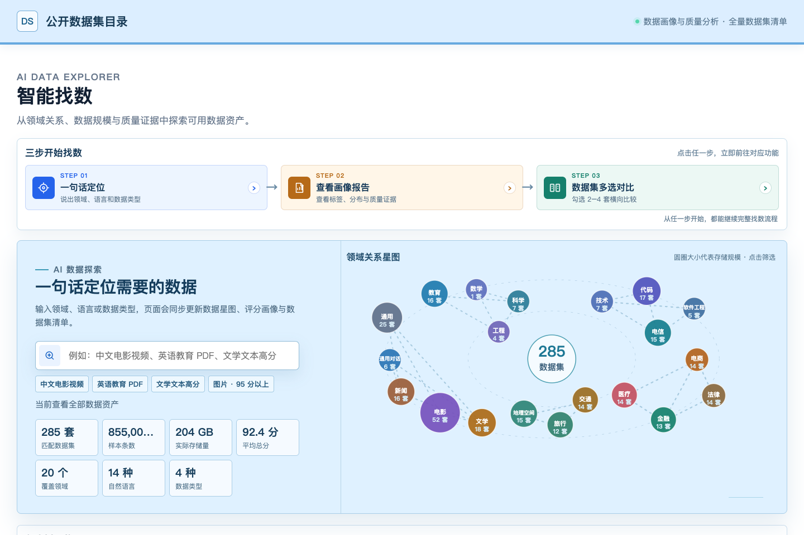

# 智能找数 · Intelligent Data Discovery

面向数据工程师的数据集目录、样本预览、画像报告、质量对比与多数据集合并工具。

**当前已公开：源码、网页源文件、画像报告和开发说明。包含实际记录及原始媒体的完整离线包尚未公开，等待单独的公开分发授权。**

完整包已在本地通过验证，但 [Releases](https://github.com/tengjie3/Crawl_Data/releases) 目前没有可下载的数据附件。授权并发布后，解压完整包即可双击 `index.html`，无需安装 Python、Node 或启动服务器。



## 下载与打开

以下是完整包获准公开后的下载方式，目前请勿将仓库源码压缩包当作完整离线应用。

完整离线包约 3.98 GB，因 GitHub 单个发布附件大小限制，拆成三个二进制分卷。它们不是三个可单独解压的 ZIP。

1. 下载 Release 中的 `intelligent-data-discovery-html-only-2026-09-16.zip.part01`、`.part02`、`.part03`，以及 `download-helpers.zip`，放在同一个文件夹。
2. 解压 `download-helpers.zip`，把里面的脚本放在上述三个分卷旁边。
3. Windows 双击 `join-windows.cmd`；macOS/Linux 在此目录运行 `sh join-macos-linux.command`。只使用系统自带命令，不需要安装 Python。脚本合并并校验完整 ZIP，不会覆盖已有文件。
4. 解压生成的 `intelligent-data-discovery-html-only-2026-09-16.zip`，用已安装的 Chrome 或 Edge 打开里面的 `index.html`。

保留完整目录，不能只复制 HTML。合并分卷及解压建议预留至少 15 GB 磁盘空间。Windows 建议使用短路径，例如 `C:\DataFind`。

GitHub 自动生成的 **Source code (zip)** 只是源码，不包含完整离线数据。请下载上面的三个分卷。

## 功能

- 一句话关键词定位，以及领域、语言、数据类型筛选和排序。
- 285 个数据集清单；每个数据集展示介绍、规模和四项评分。
- 实际文本、图片、PDF 和视频样本预览。
- 电影、教育、文学三份领域画像报告，以及 86 份数据集独立画像报告。
- 2–4 个数据集横向对比，包括三类样本级标签画像图；CSV/Excel 导出。
- 浏览器本地合并下载：读取完整记录与原始媒体，去除完全重复项，保留来源、许可、标签与失败信息。
- 合并进度、取消、历史结果和重复下载；支持分卷输出和浏览器文件夹保存。

## 本次发布范围

| 项目 | 数量 / 说明 |
|---|---|
| 数据集 | 285 |
| 记录 | 855,000，不代表全部互不重复 |
| 数据类型 | HTML/文本 206、PDF 18、图片 30、视频 31 个数据集 |
| 独立画像报告 | 电影 52、教育 16、文学 18，共 86 份 |
| 领域画像报告 | 电影、教育、文学，共 3 份 |
| 语言分类 | 13 种已识别自然语言及 UnknownLanguage |
| 网页运行 | `file://`，不依赖服务器、不加载运行时 CDN |
| 完整 ZIP | 3,975,647,640 Byte |
| 解压后文件总大小 | 5,781,226,472 Byte，107,861 个文件 |

原目录显示的 219,284,168,029 Byte 是数据集逻辑存储量，不是离线包物理大小；相同媒体使用 SHA256 寻址共享。

## 仓库结构

```text
src/offline/       浏览器合并引擎、UI、数据分片构建与测试代码
site/             目录和报告的可维护 HTML/JSON 源文件快照
docs/             开发说明、技术方案、验证记录与界面示例
distribution/     分卷合并脚本、发布清单和 SHA256 校验值
```

`site/` 不包含数 GB 的数据分片、原始媒体和预览资源，不能替代完整 Release。修改页面可将对应文件覆盖到完整解压包的同一相对位置；本仓库不会自动下载或重新采集第三方数据。开发与测试见 [DEVELOPMENT.md](docs/DEVELOPMENT.md)。

## 验证情况

发布前在 macOS / Chrome、正常安全设置下完成 `file://` 断网验证：筛选、预览、画像报告、对比、导出、实际合并、取消与历史下载。

- 310 段预览视频实际播放通过。
- 6,000 条记录合并：5,437 条保留、563 条完全重复、0 条失败；输出 10,965 个文件逐一 SHA256 校验通过。
- 完整包迁至独立目录，并禁止浏览器读取原项目后，报告、媒体和合并测试仍通过。
- Windows/Linux 未在真实系统完成端到端测试；推荐使用 Chrome/Edge。媒体播放能力仍受浏览器解码支持影响。

证据见 [docs/verification](docs/verification)；原始完整校验记录随 Release 的 `VERIFICATION.json` 和 `package_manifest.json` 交付。

## 数据与评分边界

- 公开版对 57 条记录中的 2 个不同疑似第三方 API Key 做了片段替换，共 139 次出现；未删除整条样本，媒体不变。记录内保留脱敏说明和原归档 SHA256，详见离线包 `PUBLICATION_REDACTIONS.json`。本地原始包没有被覆盖。模式扫描不等于对全部隐私或许可的人工审核。
- 本仓库发布的是当前智能找数静态离线应用，不是完整 HiDataAgent 后台，不包含 7×24 采集 worker、生产服务密钥或自动重新评分服务。
- 一句话定位使用确定性的关键词规则，不是在线 LLM 或语义向量检索。
- 四项评分是归档评估结果，OpenDataArena 项为本地代理指标，不代表官方完整训练评测。评分不是版权许可批准，也不是模型增训效果保证。
- 归档总分权重为 25% / 20% / 25% / 30%；旧页面标签写为各 25%。本次发布保留原结果，并明确披露此既有差异，没有为了发布而调整分数。
- 部分语言标签来源于关联字幕或上下文，不代表媒体音轨语言；未知标签不强行推断。
- 公开可访问不等于可任意再分发或训练。数据保留原来源及许可字段，使用者仍须逐项核对授权、个人信息和适用条款；未知许可不视为授权。
- 离线报告和数据操作不需要联网，但点击原始来源的外部网址仍需要网络。

第三方依赖与数据权利说明见 [THIRD_PARTY_NOTICES.md](THIRD_PARTY_NOTICES.md)。
